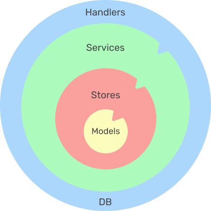

# Go Echo Simple API with Clean Architecture

## 🤓 About this repo
This is a sample of Web API built by Go (Echo) according to *Clean architecture*.  
But I have to say that I'm not a backend specialist nor of Go, so Clean architecture here could be wrong or missing essential concepts. (I'm sorry in that case)

This sample consists of 4 layers, "Models", "Stores", "Services(Logic)" and "Handlers(Framework)", although naming might differ in another sample.
Each layer only concerns/handles its inside layer, not the other way around.
This makes it super easy to replace each layer. (also good for testing)



#### What you might find helpful in this repo.
- [x] [echo](https://github.com/labstack/echo)(Framework) for handling requests
- [x] Clean architecture
- [x] swagger([swaggo/echo-swagger](https://github.com/swaggo/echo-swagger)) for documentation
- [x] Database transaction in service layer
- [x] sqlmock ([DATA-DOG/go-sqlmock](https://github.com/DATA-DOG/go-sqlmock)) for testing
- [x] goose([pressly/goose](https://github.com/pressly/goose)) for migration
- [x] Multi-stage build for optimized docker image
- [x] Hot reload([cosmtrek/air](https://github.com/cosmtrek/air)) for efficient development
- [x] JWT authentication([auth0/go-jwt-middleware](https://github.com/auth0/go-jwt-middleware/)) with [Auth0](https://auth0.com/) for security
- [x] Automated testing on GitHub actions 

## 👟 How to run
Install.
```shell
git clone git@github.com:zett-8/go-clean-echo.git

cd go-clean-echo
```

Download dependencies.
```shell
go mod download
```

Fill out auth0 config to run with JWT authentication. Or simply disable JWT middleware
```go
// configs/auth0.go
var Auth0Config = auth0Config{
	Domain:             "",
	ClientID:           "",
	Issuer:             "",
	Audience:           []string{""},
	SignatureAlgorithm: validator.RS256,
	CacheDuration:      15 * time.Minute,
}

// or 

// handlers/handlers.go
func SetApi(e *echo.Echo, h *Handlers, m echo.MiddlewareFunc) {
    g := e.Group("/api/v1")
    g.Use(m) // <- Comment out this line
}
```

Run docker.
```shell
docker-compose up
```

## 🌱 Tips 

### Use multi-stage build
Using multistage build reduces the size of the docker image.

```dockerfile
# Base image for local development. Use 'air' for hot reload.
FROM golang:1.18-alpine as base

ENV PORT=8888
ENV GO_ENV=development

WORKDIR /app/go/base

COPY go.mod .
COPY go.sum .

RUN go mod download
RUN go install github.com/cosmtrek/air@latest

COPY . .


# The image for build. Set CGO_ENABLE=0 not to build unnecessary binary.
FROM golang:1.18-alpine as builder

ENV PORT=8888

WORKDIR /app/go/builder

COPY --from=base /app/go/base /app/go/builder

RUN CGO_ENABLED=0 go build main.go


# The final image to run 
FROM alpine as production

WORKDIR /app/go/src

RUN apk add --no-cache ca-certificates
COPY --from=builder /app/go/builder/main /app/go/src/main

EXPOSE 8888

CMD ["/app/go/src/main"]
```

### Use "Air" for hot reload
We used to have other reloaders such as [realize](https://github.com/oxequa/realize).
But it seems no longer be developed or maintained, so I recommend to use "air"

> [cosmtrek/air](https://github.com/cosmtrek/air).

### Mock a unit for testing
Here is one example to mock "service" for "handler" test.

Let's say this is the service to mock.
```go
// services/services.go
type Services struct {
    AuthorService
    BookService
}

func New(s *stores.Stores) *Services {
    return &Services{
        AuthorService: &AuthorServiceContext{s.AuthorStore},
        BookService:   &BookServiceContext{s.BookStore},
    }
}

// services/author.go
type AuthorService interface {
	GetAuthors() ([]models.Author, error)
	DeleteAuthor(id int) error
}

type AuthorServiceContext struct {
	store stores.AuthorStore
}

func (s *AuthorServiceContext) GetAuthors() ([]models.Author, error) {
	r, err := s.store.Get()
	return r, err
}

func (s *AuthorServiceContext) DeleteAuthor(id int) error {
	err := s.store.DeleteById(id)
	return err
}
```

And in /handlers/author_test.go. Declare Mock struct.
```go
// handlers/author_test.go
type MockAuthorService struct {
	services.AuthorService
	MockGetAuthors       func() ([]models.Author, error)
	MockDeleteAuthorById func(id int) error
}

func (m *MockAuthorService) GetAuthors() ([]models.Author, error) {
	return m.MockGetAuthors()
}

func (m *MockAuthorService) DeleteAuthor(id int) error {
	return m.MockDeleteAuthorById(id)
}
```

Then use it as mockService.
```go
// handlers/author_test.go
func TestGetAuthorsSuccessCase(t *testing.T) {
    s := &MockAuthorService{
        MockGetAuthors: func () ([]models.Author, error) {
            var r []models.Author
            return r, nil
        },
    }
    
    mockService := &services.Services{AuthorService: s}
    
    e := Echo()
    h := New(mockService)
}
```

## 📃 API Document (Swagger)
```text
http://localhost:8888/swagger/index.html
```

## ✅ Testing
```shell
make test
```

## 💜 References
[bxcodec/go-clean-arch](https://github.com/bxcodec/go-clean-arch)  
[onakrainikoff/echo-rest-api](https://github.com/onakrainikoff/echo-rest-api)  
[satishbabariya/go-echo-auth0-middleware](https://github.com/satishbabariya/go-echo-auth0-middleware)  
[xesina/golang-echo-realworld-example-app](https://github.com/xesina/golang-echo-realworld-example-app)  

